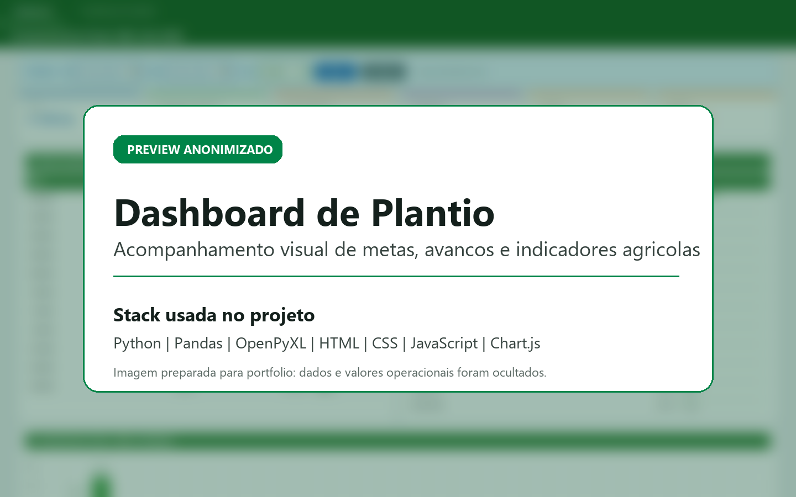
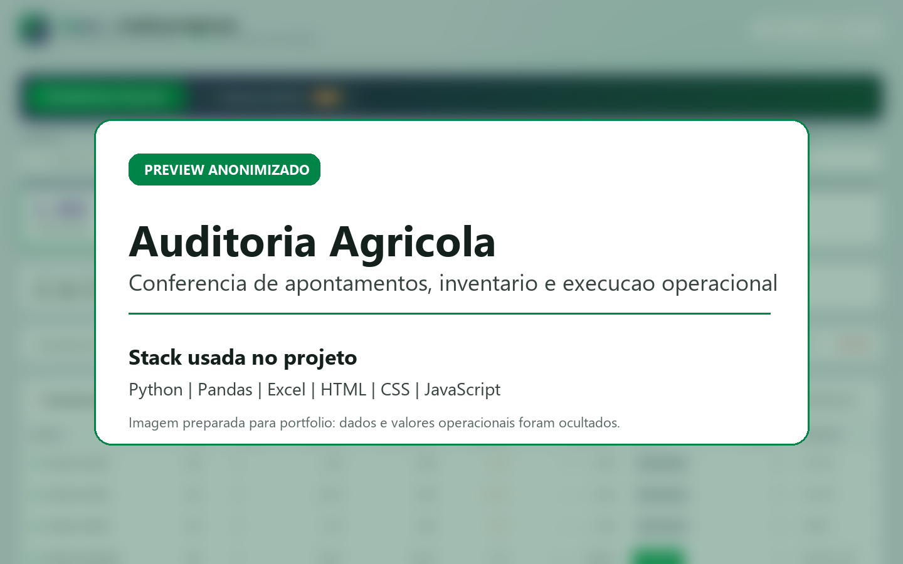
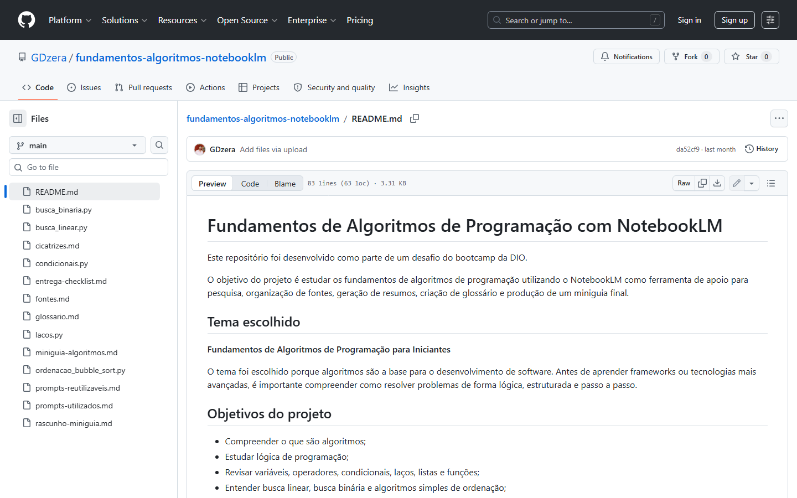

# Guilherme Dias Steinhardt

> Dados, automação e dashboards para operações agrícolas

Sou estudante de **Ciência de Dados** e atuo no **Bioparque da Raízen**
como Analista de Preparo, Plantio, Colheita e Transporte. Minha trajetória
une vivência operacional no campo, monitoramento agrícola, SGPA, telemetria
e desenvolvimento de soluções com dados.

Meu foco é transformar rotinas manuais, planilhas e indicadores operacionais
em ferramentas simples de usar: automações, validações, painéis web e análises
que ajudam a operação a enxergar melhor o que está acontecendo.

## Como eu gero valor

- Estruturo dados agrícolas para acompanhamento de plantio, colheita,
  corretivos, apontamentos e indicadores operacionais.
- Automatizo conferências e consolidações que antes dependiam de processos
  manuais ou repetitivos.
- Crio dashboards web para facilitar leitura, comparação e tomada de decisão.
- Uno conhecimento de operação agrícola com tecnologia, buscando soluções
  práticas para problemas reais do dia a dia.

## Projetos em destaque

### [painel-plantio](https://github.com/GDzera/painel-plantio)

Projeto voltado ao acompanhamento de operações agrícolas por meio de rotinas
em Python e dashboards HTML.

**Principais entregas:**

- Leitura, tratamento e consolidação de planilhas operacionais.
- Dashboards para plantio, colheita, corretivos e apontamentos.
- Validações entre bases para apoiar conferência de dados.
- Geração de interfaces web com HTML, CSS, JavaScript e Chart.js.

<!-- markdownlint-disable MD033 -->

  
  

<!-- markdownlint-enable MD033 -->

**Tecnologias:** Python, Pandas, NumPy, OpenPyXL, Excel, HTML, CSS,
JavaScript e Chart.js.

> Em projetos com dados operacionais reais, minha prioridade é trabalhar com
> versões anonimizadas ou bases fictícias para publicação em portfólio.

### [fundamentos-algoritmos-notebooklm](https://github.com/GDzera/fundamentos-algoritmos-notebooklm)

Projeto de estudo sobre fundamentos de algoritmos, lógica de programação e uso
de IA como apoio à organização do aprendizado.

**Principais entregas:**

- Miniguia de algoritmos para iniciantes.
- Exemplos simples em Python.
- Glossário, fontes, prompts e registro das dificuldades encontradas.
- Documentação do processo de estudo com apoio do NotebookLM.

<!-- markdownlint-disable MD033 -->

  

<!-- markdownlint-enable MD033 -->

## Stack principal

### Dados, automação e análise

### Dashboards e ferramentas

## Atualmente estudando

- Modelagem e análise de dados.
- Boas práticas de Python para automação.
- Dashboards e storytelling com dados.
- Organização de projetos para portfólio técnico.

## Contato

